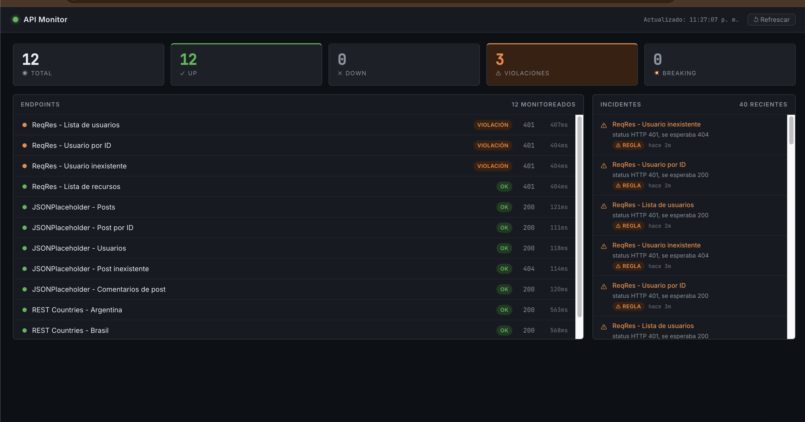

# Sistema de Auditoría Continua de APIs

Sistema de monitoreo que chequea APIs REST de forma automática y detecta problemas en tres dimensiones: disponibilidad, cambios de contrato, y violaciones de reglas. Guarda histórico en SQLite y lo presenta en un dashboard visual interactivo.



---

## El problema que resuelve

Las APIs de terceros cambian sin avisar. Un campo que existía puede desaparecer, un endpoint puede empezar a fallar, o la latencia puede degradarse sin que nadie lo note hasta que el sistema que depende de esa API se rompe. Este sistema monitorea continuamente y alerta sobre esos cambios antes de que impacten en producción.

---

## Qué detecta

### 1. Disponibilidad (Fase 1)
- Si el endpoint responde o no (`is_up`)
- Código de estado HTTP
- Latencia en milisegundos
- Historial completo para detectar tendencias

### 2. Cambios de schema / breaking changes (Fase 2)
Compara la estructura de cada respuesta JSON contra un *baseline* guardado la primera vez:
- **Non-breaking**: campo nuevo en la respuesta (no rompe a los consumidores)
- **Breaking**: campo que desapareció o cambió de tipo (rompe a los consumidores)
- **Type uncertain**: campo pasó de `null` a un tipo concreto o viceversa (probable campo opcional)

### 3. Reglas de validación (Fase 3)
Reglas definidas por endpoint en el `config.yaml`:
- `status_esperado`: el código HTTP debe ser X
- `latencia_maxima`: la respuesta debe llegar en menos de N ms
- `campo_requerido`: un campo (incluso anidado con notación de puntos) debe estar presente
- `formato_campo`: los valores de un campo deben cumplir un formato (`email`, `no_vacio`, `es_numero`)

Para reglas sobre arrays, el sistema reporta cuántos elementos fallaron: *"campo 'email' ausente en 2 de 10 elementos"*.

---

## Cómo funciona

```
config.yaml → define endpoints + reglas
     ↓
Pasada de chequeo (manual o scheduler)
     ↓
  extractor.py  → HTTP request + latencia
  checker.py    → resultado del chequeo
  schema_extractor.py → schema de la respuesta JSON
  schema_comparator.py → diferencias vs baseline
  rules.py      → evaluación de reglas
     ↓
  database.py → SQLite (4 tablas)
     ↓
API FastAPI → /api/endpoints, /api/incidents, /api/summary
     ↓
Dashboard React → gráficos + estado en tiempo real
```

---

## Stack

| Componente | Tecnología |
|------------|------------|
| Motor de chequeo | Python 3.10+ · stdlib pura (httpx, pyyaml) |
| API backend | FastAPI · Uvicorn |
| Scheduler | APScheduler 3 (`BlockingScheduler` standalone / `BackgroundScheduler` embebido) |
| Base de datos | SQLite (un solo archivo, sin instalar nada) |
| Dashboard | React 18 · Vite · Recharts |

APIs de demo (sin autenticación): **JSONPlaceholder**, **REST Countries**, **ReqRes** (sirve como ejemplo de endpoint con problema activo).

---

## Estructura del proyecto

```
auditor-apis/
├── config.yaml              # Endpoints + reglas a monitorear
├── requirements.txt
└── src/
    ├── checker.py           # HTTP request + medición de latencia
    ├── config.py            # Lee y valida config.yaml
    ├── database.py          # SQLite: 4 tablas (checks, schemas, schema_changes, rule_violations)
    ├── rules.py             # Evaluación de reglas
    ├── run_check.py         # CLI: una pasada manual
    ├── run_scheduler.py     # Scheduler standalone (BlockingScheduler)
    ├── schema_comparator.py # Compara schemas, clasifica cambios
    ├── schema_extractor.py  # Extrae schema de respuesta JSON
    └── api.py               # FastAPI + BackgroundScheduler embebido
└── frontend/
    └── src/
        ├── App.jsx          # Orchestrador + auto-refresh 30s
        ├── api.js           # 4 llamadas a los endpoints
        └── components/
            ├── SummaryCards.jsx
            ├── EndpointList.jsx
            ├── HistoryChart.jsx
            └── IncidentsPanel.jsx
```

---

## Instalación y uso

### Requisitos
- Python 3.10+
- Node.js 18+

### Backend

```bash
# Crear entorno virtual e instalar dependencias
python -m venv .venv
source .venv/bin/activate        # Windows: .venv\Scripts\activate
pip install -r requirements.txt

# Opción A: una sola pasada manual (útil para probar)
python src/run_check.py

# Opción B: scheduler standalone (corre cada N minutos en la terminal)
python src/run_scheduler.py

# Opción C: API + scheduler embebido (recomendado para uso normal)
uvicorn src.api:app --reload --port 8000
```

La primera pasada se ejecuta de forma inmediata al arrancar. El intervalo se configura en `config.yaml` con `check_interval_minutes`.

### Dashboard

```bash
cd frontend
npm install
npm run dev
# → http://localhost:5173
```

La API debe estar corriendo en `http://localhost:8000` (CORS habilitado).

---

## Configurar endpoints

Editar `config.yaml`:

```yaml
settings:
  timeout_seconds: 10
  check_interval_minutes: 5

endpoints:
  - name: "Mi API - Endpoint de usuarios"
    method: GET
    url: "https://api.ejemplo.com/users"
    expected_status: 200
    rules:
      - type: status_esperado
        valor: 200
      - type: latencia_maxima
        ms: 500
      - type: campo_requerido
        campo: id
      - type: formato_campo
        campo: email
        formato: email
```

---

## Endpoints de la API

| Endpoint | Descripción |
|----------|-------------|
| `GET /api/summary` | Números globales: total, up/down, violaciones, breaking changes |
| `GET /api/endpoints` | Estado actual de cada endpoint con violaciones activas |
| `GET /api/endpoints/{nombre}/history` | Histórico de chequeos para graficar tendencias |
| `GET /api/incidents` | Lista combinada de violaciones y breaking changes |
| `GET /health` | Estado del servidor |

---

*Sistema de monitoreo de APIs · Demo con APIs públicas gratuitas · Python + FastAPI + React*
